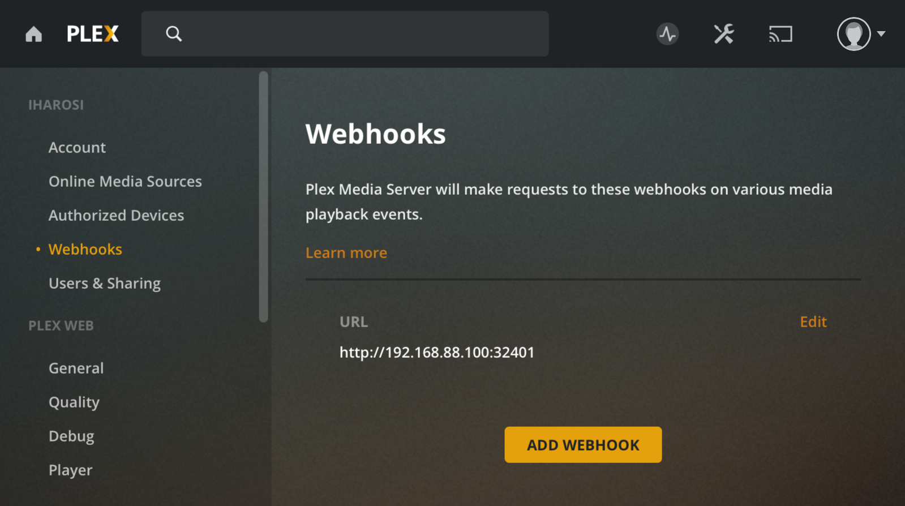

# Plex Webhooks Server plugin for Homebridge
[](https://www.npmjs.com/package/homebridge-plex-webhooks)
[](https://www.npmjs.com/package/homebridge-plex-webhooks)

This [Homebridge](https://github.com/homebridge/homebridge) plugin can expose occupancy sensor(s) in Home app what will trigger occupancy when media starts playing through a Plex client. Thanks to the unlimited filtering criterias, occupancy events can be controlled based on several different attributes (e.g.: Plex servers, Plex clients, Plex users, media types, media metadata). 

This plugin uses Plex's [Webhooks](https://support.plex.tv/articles/115002267687-webhooks/) feature which is the best available option at the moment to create quick and smooth automation experience. 

Please note, Webhooks are a premium feature and requires an active [Plex Pass Subscription](https://support.plex.tv/articles/categories/intro-to-plex/plex-pass-subscriptions/) for the Plex Media Server account. Based on past years experience, once or twice a year Plex Inc discounts its life time licence.  
However, if you don't own or plan to buy Plex Pass, you can try this plugin instead, but please note I'm not planning to maintain this plugin anymore: [homebridge-plex-v2](https://github.com/iharosi/homebridge-plex-v2) 

## Installation

If you don't have a Homebridge installation yet, head over to the [project documentation](https://github.com/homebridge/homebridge) for more information. 

The best and easiest way to install and configure this plugin is through [Homebridge UI](https://github.com/oznu/homebridge-config-ui-x). 

However, if you would like to you can do it through terminal:

```sh
npm install homebridge-plex-webhooks
```

Or, you can install it for root but please be aware of the security risks:

```sh
sudo npm install -g --unsafe-perm homebridge-plex-webhooks
``` 

## Configuration

The easiest way to configure this plugin is through [Homebridge UI](https://github.com/oznu/homebridge-config-ui-x). 

Available options:

Property name | Optional/Required | Type | Description
------------- | ----------------- | ---- | -----------
`name` | **required** | String | This is the name of the platform, doesn't really show up anywhere but it's required.
`platform` | **required** | String | Must be `PlexWebhooks`.
`sensors` | **required** | Array | At least one sensor should be exposed.
`sensors.name` | **required** | String | This is how the occupancy sensor will show up in Home app.
`sensors.filters` | optional | Array | Filter rulesets. For the specified sensor to be activated, all the given path-value pairs in the ruleset must found in Plex's payload. In case multiple rulesets have been given, at least one ruleset of path-value pairs must found in the payload. You will get ideas from the [Webhooks support article](https://support.plex.tv/articles/115002267687-webhooks/#toc-3).
`server` | optional | Object | Listening port and IP address customization of the plugin's webhooks server.
`server.port` | optional | String | Port can be given between 1024 and 65535. In case port is omitted, the default 32401 will be used.
`server.address` | optional | String | The server can be forced to bind to the specified IP address. In case it's omitted, server will bind to the default interface.
`verbose` | optional | Boolean | For debugging purposes. With verbose logging the plugin will log Plex's payload and path-value pair matching information into the Homebridge logs.

Simple config with one filter:

```json
"platforms": [
  {
    "name": "Plex Webhooks Platform",
    "platform": "PlexWebhooks",
    "sensors": [
      {
        "name": "Plex Movies",
        "filters": [
          [
            {
              "path": "Metadata.librarySectionType",
              "value": "movies"
            }
          ]
        ]
      }
    ]
  }
]
```

Advanced config with multiple sensors and filters with custom server options and verbose logging:

```json
{
  "name": "Plex Webhooks Platform",
  "platform": "PlexWebhooks",
  "sensors": [
    {
      "name": "Plex Movies",
      "filters": [
        [
          {
            "path": "Account.title",
            "value": "Guest"
          }
        ],
        [
          {
            "path": "Metadata.librarySectionType",
            "value": "movies"
          },
          {
            "path": "Player.title",
            "value": "Apple TV"
          }
        ]
      ]
    },
    {
      "name": "Plex Shows",
      "filters": [
        [
          {
            "path": "Metadata.librarySectionType",
            "value": "shows"
          },
          {
            "path": "Player.title",
            "value": "Safari"
          }
        ]
      ]
    }
  ],
  "server": {
    "address": "192.168.88.100",
    "port": 32401
  },
  "verbose": true
}
```

## Set up Plex Media Server

After you launch homebridge, look for the listening URL:  


Add this URL as a webhook URL on your [Plex Media Server Webhooks settings page](https://app.plex.tv/desktop#!/settings/webhooks):  



In case your Homebridge server and PMS server is not on the same network, must probably you need to use NAT.

## Questions, issues, feature requests

Before you [raise a ticket](https://github.com/iharosi/homebridge-plex-webhooks/issues/new/choose), try to run Homebridge with the `--debug` option or set verbose logging for the plugin and look for the payload in console. Make sure your config is valid and your filtering rules are correct. For easier debugging, please provide your config.
